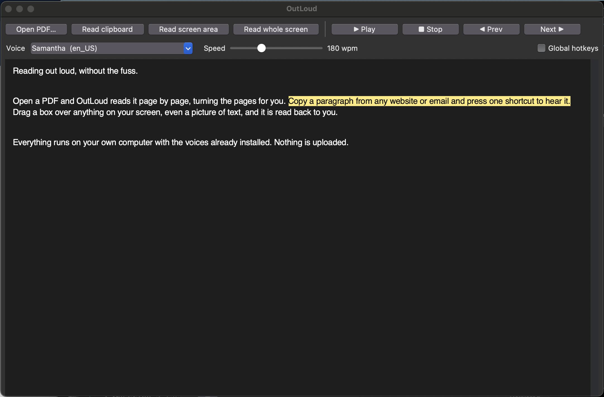

# OutLoud

Reads PDFs and any text on your screen out loud. Mac and Windows. Free, works offline, and uses the voices already on your computer. Nothing is uploaded anywhere.



## What it does

- **Open a PDF** and it reads it to you, page after page, highlighting the sentence it is on. Scanned PDFs work too (it reads the page image).
- **Read anything you select.** Select text in any app, press one shortcut, hear it.
- **Read anything on screen.** Drag a box over any part of the screen, even a picture of text, and it is read back.
- **Paste text** straight into the window and press Play.
- Pick a **voice**, set the **speed**, click a sentence to start there, double-click to jump.

## Install on a Mac (the easy way)

1. Download **OutLoud-mac-arm64.zip** from the [latest release](https://github.com/marcpineault/outloud/releases/latest) and unzip it.
2. Drag **OutLoud.app** into Applications and double-click it.
3. macOS will say it cannot check the app for malware, because it is not from the App Store. Click **Done**, open **System Settings > Privacy & Security**, scroll down and click **Open Anyway**. You only do this once.

   (Alternative for the terminal-minded: `xattr -dr com.apple.quarantine /Applications/OutLoud.app`)
4. The first time you use a feature, macOS asks for a permission. Say yes:
   - **Screen Recording** for "Read screen area" and "Read whole screen".
   - **Accessibility** and **Input Monitoring** for the global hotkeys.

Intel Mac? Run from source (below), or build the app yourself with `pyinstaller packaging/OutLoud.spec`.

## Install on Windows

1. Download **OutLoud-windows-x64.zip** from the [latest release](https://github.com/marcpineault/outloud/releases/latest), unzip it anywhere.
2. Run **OutLoud.exe**. If SmartScreen complains, click **More info > Run anyway**.

Screen reading on Windows uses the OCR built into Windows 10/11 (English language pack). Voices come from Windows itself; add more under Settings > Time & Language > Speech.

## Using it

| Do this | To get |
|---|---|
| Open PDF… | Reads the PDF from page 1, turning pages by itself |
| Read clipboard | Reads whatever you last copied |
| Read screen area | Dims the screen; drag a box; reads what is inside |
| Read whole screen | Reads everything on the main display |
| Play / Pause, Stop, Prev, Next | Transport. Space, Escape and the arrow keys do the same inside the window |
| Click a sentence, then Play | Starts reading from that sentence |
| Double-click a sentence | Jumps there while reading |
| Voice, Speed | Any voice installed on your computer; 100 to 350 words per minute |
| Cmd/Ctrl + and Cmd/Ctrl - | Bigger or smaller text |

**Global hotkeys** (tick the box at the top right) work while you are in any other app:

| Mac | Windows | Does |
|---|---|---|
| Control + Option + R | Ctrl + Alt + R | Read the text you have selected |
| Control + Option + A | Ctrl + Alt + A | Drag a box on screen and read it |
| Control + Option + P | Ctrl + Alt + P | Play / pause |
| Control + Option + S | Ctrl + Alt + S | Stop |

## Better voices (Mac)

The stock voices are fine; the downloadable ones are much better. System Settings > Accessibility > Spoken Content > System voice > Manage Voices… then download an English voice marked **Premium** or **Enhanced** (for example Ava, Zoe, Evan). They appear in OutLoud's Voice menu and are chosen by default once installed.

Siri voices cannot be used by apps, which is why "System default voice" can be silent if your Mac's system voice is a Siri voice. Pick a named voice instead.

## Run from source (any OS, and for AI agents)

Needs Python 3.9 or newer. With [uv](https://docs.astral.sh/uv/) installed, this is a one-liner:

```
uvx --from git+https://github.com/marcpineault/outloud outloud
```

Or clone and run:

```
git clone https://github.com/marcpineault/outloud
cd outloud
uv run outloud            # or: pip install -e . && outloud
```

Mac users can also double-click `run-mac.command`; Windows users `run-windows.bat`.

Tests: `uv run pytest`. Build the app: `uv run --extra dev pyinstaller packaging/OutLoud.spec` (output in `dist/`). Pushing a tag like `v0.2.0` makes GitHub build both apps and publish a release.

## Troubleshooting

- **No sound on Mac.** Choose a named voice; see "Better voices" above. Check the volume and that the Mac is not muted.
- **"Read screen area" finds no text.** Grant Screen Recording to OutLoud (or to Terminal if you run from source), then try again. Larger text reads better than tiny text.
- **Hotkeys do nothing.** Grant Accessibility and Input Monitoring, then untick and re-tick Global hotkeys. Running from source means the permission goes to your terminal app, not to OutLoud.
- **A PDF page reads as "(no readable text)".** The page is an image and OCR found nothing; zoomed-out scans of tiny text are the usual cause.
- **Windows and OCR.** If the Windows build could not include the OCR engine, run from source and `pip install winocr`, or `pip install rapidocr-onnxruntime` for a self-contained engine.

Windows has not been tested by a human yet (built and unit-tested on GitHub's Windows runners only). Reports welcome.

## For developers and AI agents

Start with [AGENTS.md](AGENTS.md): what each file does, the rules of the codebase, how to test and release, and the backlog.

MIT licensed.
